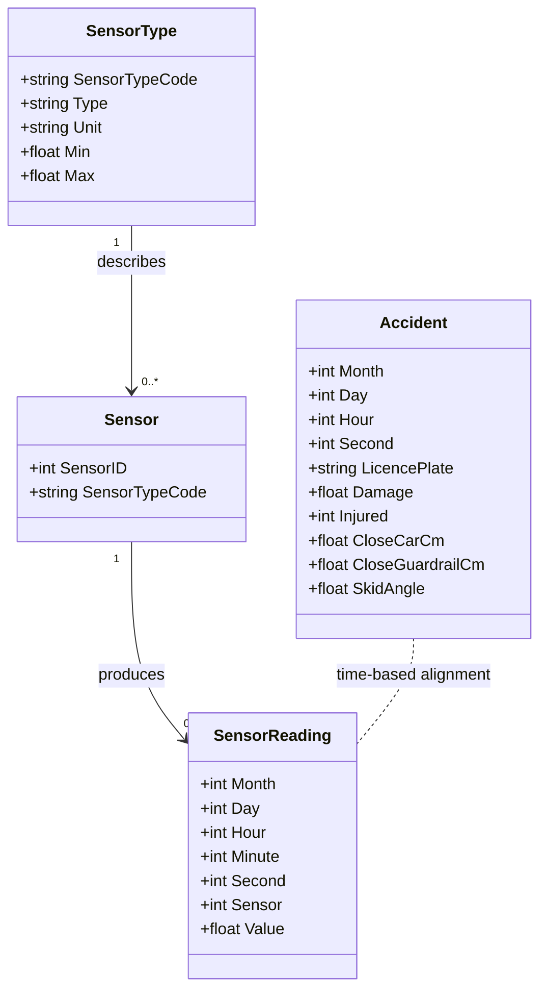

```mermaid
classDiagram
    direction TB

    class SensorType {
        +string SensorTypeCode
        +string Type
        +string Unit
        +float Min
        +float Max
    }

    class Sensor {
        +int SensorID
        +string SensorTypeCode
    }

    class SensorReading {
        +int Month
        +int Day
        +int Hour
        +int Minute
        +int Second
        +int Sensor
        +float Value
    }

    class Accident {
        +int Month
        +int Day
        +int Hour
        +int Second
        +string LicencePlate
        +float Damage
        +int Injured
        +float CloseCarCm
        +float CloseGuardrailCm
        +float SkidAngle
    }

    SensorType "1" --> "0..*" Sensor : describes
    Sensor "1" --> "0..*" SensorReading : produces
    Accident .. SensorReading : time-based alignment

```